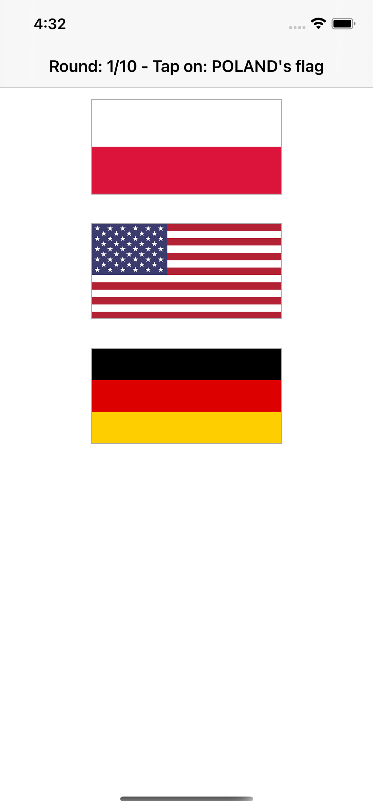
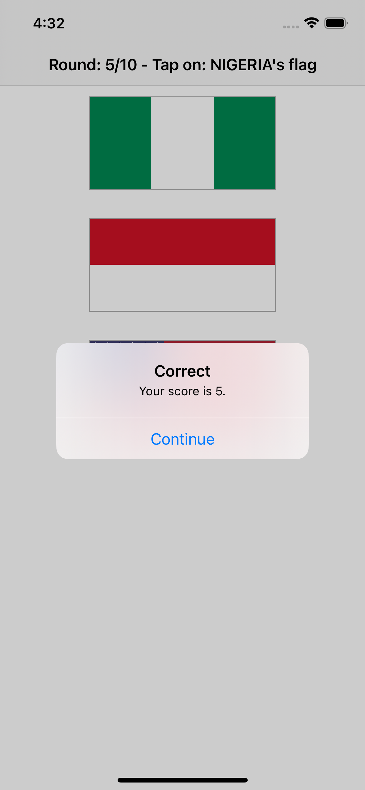
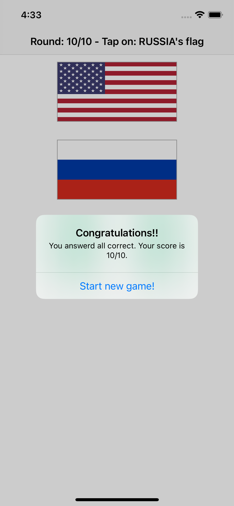

# Project 2 with Swift

## Description
In this application, I created an iOS game that shows random flags to users and asks them to choose which one belongs to a particular country.

In this app, I learned how to place buttons, use Auto Layout rules, about asset catalog, and the use of @IBOutlet and @IBAction.

    
    
    

## Information behind the app
This application was created following the tutorial of [Hacking with swift](https://www.hackingwithswift.com/100).

Technologies used to build this app are XCode and Swift. 
Framework: Cocoa Touch.